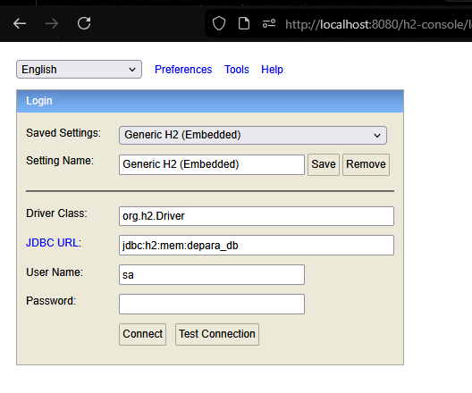
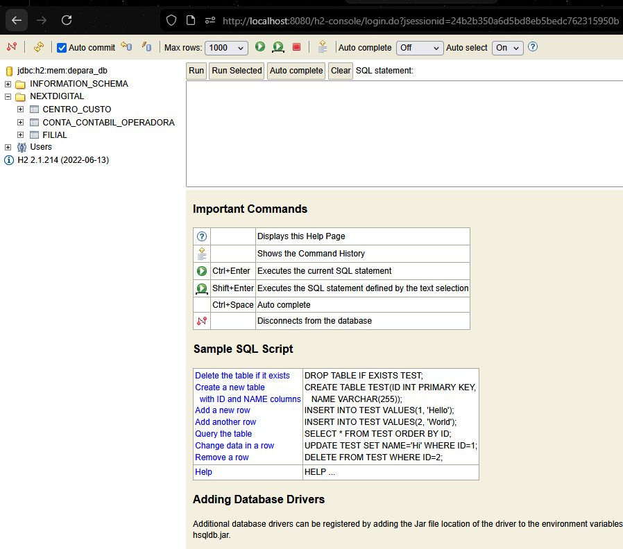

# De-Para API

Sistema para importação de dados de de-para via Excel, com validações de negócio, auditoria automática e simulação de banco Oracle utilizando H2.

---

# Visão Geral

Este projeto permite:

- Upload de planilha Excel
- Validação de dados (filial + sistema legado)
- Insert ou Update automático
- Geração de arquivos de auditoria
- Execução segura e rastreável

---

# Endpoints

## Download do modelo

GET http://localhost:8080/api/depara/modelo

---

## Importação

POST http://localhost:8080/api/depara/centro-custo/import  
POST http://localhost:8080/api/depara/conta-contabil-operadora/import  

Formato: multipart/form-data  
Campo: arquivo

---

# Regras de Negócio

## Sistema Legado

Valores permitidos:

- SOLUS
- MV
- TASY

Regras:
- ignorecase
- trim
- normalização para UPPERCASE

---

## Validação de Filial

Valida existência na tabela FILIAL.

Se não existir:
→ vai para lista de erros

---

## Regra principal

- Não existe → INSERT
- Já existe → UPDATE

---

# Banco H2

Console:
http://localhost:8080/h2-console

JDBC URL:
jdbc:h2:mem:depara_db

---

# Swagger

http://localhost:8080/swagger-ui.html

ou se preferir a uma collection do Postman dentro do projeto.

---

# Auditoria

Arquivos gerados em:

/src/main/resources/executados/{data-hora-destino}

Arquivos:

- auditoria.json → resumo da execução
- insert.sql → inserts executados
- update.sql → updates executados
- rollback.sql → deletes para rollback

---

# Tecnologias

- Java 8
- Spring Boot
- JdbcTemplate
- H2
- Lombok

---
# Como rodar

## Backend

mvn spring-boot:run

(Requer Lombok para rodar na IDE)

---